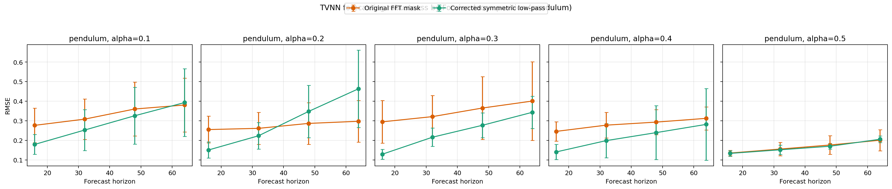
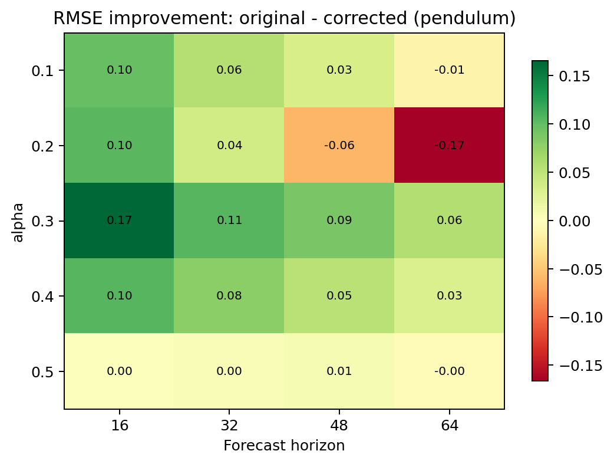
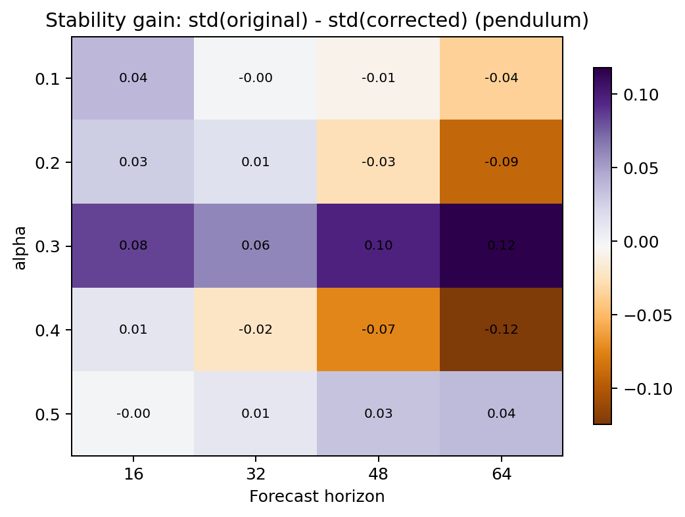
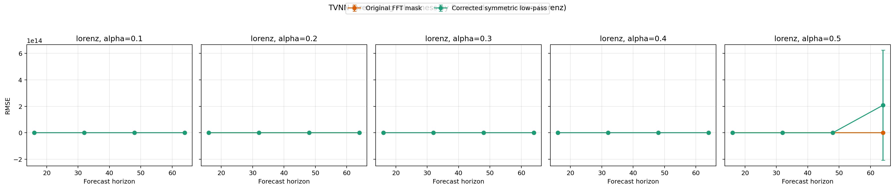
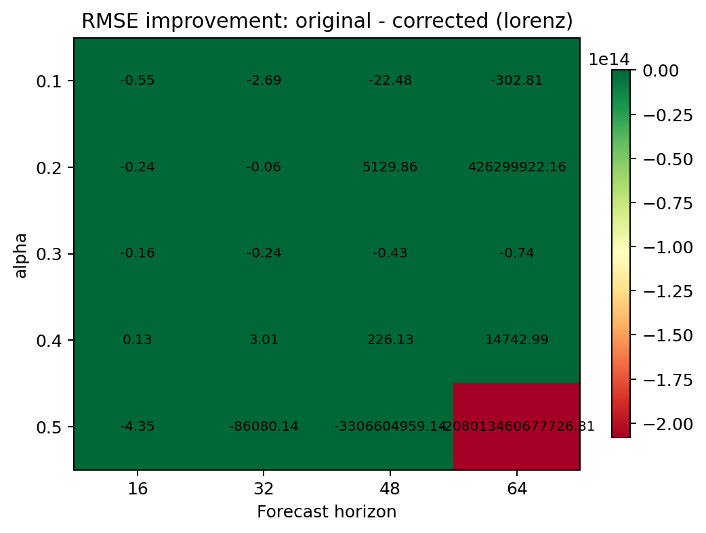
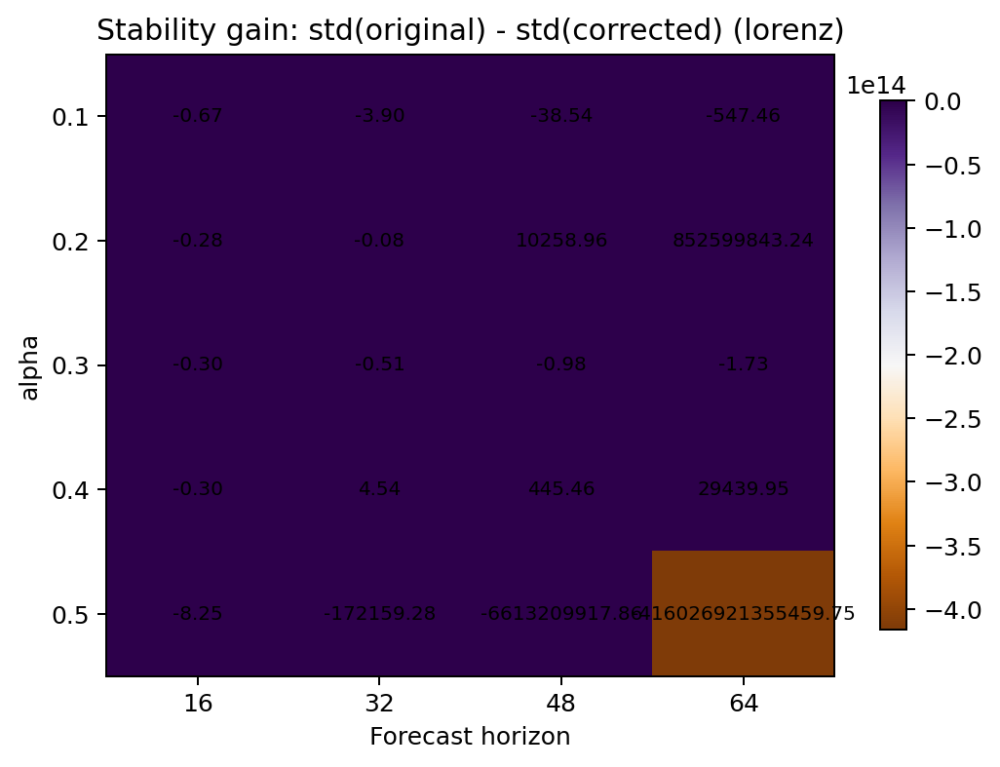

# TVNN Manuscript Revision Package


Independent experiment package for a robustness, reproducibility, and baseline reassessment of the public code associated with the manuscript **“Time-Varying Biological Time-Series Prediction and Pattern Interpretation using Koopman Theory and Large Language Models.”**

> This repository contains **experiment code, raw result files, and generated figures only**. It intentionally excludes manuscript PDFs, DOCX files, and article-packaging materials.

## What this repository contains

### Forecasting-side additions
- TVNN reproducibility smoke test
- Fourier decomposition audit
- Extended comparison between the released FFT mask and a symmetric low-pass alternative
- Robustness atlas over `alpha`, forecast horizon, and random seed

### TVPRLLM-side additions
- Baseline reassessment under the released chronological 80/20 split
- Stratified 5-fold cross-validation sanity check
- Comparisons against simple non-LLM baselines

## Main findings

1. **The released Fourier masking strategy materially affects forecasting behavior.**
2. **Changing the decomposition can alter both RMSE and numerical stability**, including catastrophic long-horizon divergence on the Lorenz system under some settings.
3. **The released TVPRLLM tasks are highly separable for simple classifiers**, weakening any strong claim that an LLM is required for the released recognition benchmark.

## Repository layout

```text
.
├── experiments/
│   ├── figures/          # Generated plots used in the audit
│   ├── results/          # Raw JSON outputs from experiment runs
│   ├── tvnn_*.py         # Forecasting-side audit scripts
│   └── tvprllm_*.py      # TVPRLLM-side baseline scripts
├── notes/
│   └── experiment_plan_tvnn.md
├── CHANGELOG.md          # Lab-notebook style progress log
└── README.md
```

## Experiment scripts

### Forecasting
- `experiments/tvnn_fourier_audit.py`
- `experiments/tvnn_fourier_extended.py`
- `experiments/tvnn_fourier_robustness_atlas.py`

### TVPRLLM baselines
- `experiments/tvprllm_baseline_audit.py`
- `experiments/tvprllm_baseline_cv.py`

## Quick start

These scripts expect a local clone of the upstream public repository placed at `repo_tvnn/`.

### 1. Clone the upstream source

```bash
git clone https://github.com/347251369/Time-Varying-Biological-Time-Series-Prediction.git repo_tvnn
```

### 2. Run selected experiments

```bash
python experiments/tvnn_fourier_audit.py
python experiments/tvnn_fourier_extended.py
python experiments/tvnn_fourier_robustness_atlas.py
python experiments/tvprllm_baseline_audit.py
python experiments/tvprllm_baseline_cv.py
```

### 3. Inspect outputs

- raw metrics: `experiments/results/*.json`
- figures: `experiments/figures/*.png`

## Selected visual results

### Pendulum: robustness atlas line plots



### Pendulum: RMSE improvement heatmap



### Pendulum: stability heatmap



### Lorenz: robustness atlas line plots



### Lorenz: RMSE improvement heatmap



### Lorenz: stability heatmap



## Notes on scope

Included:
- experiment scripts
- generated figures
- raw JSON outputs
- experiment planning notes
- progress log

Excluded:
- manuscript PDFs
- DOCX files
- insertion-ready article text packages
- the upstream cloned repository

## Upstream repository analyzed

- https://github.com/347251369/Time-Varying-Biological-Time-Series-Prediction
